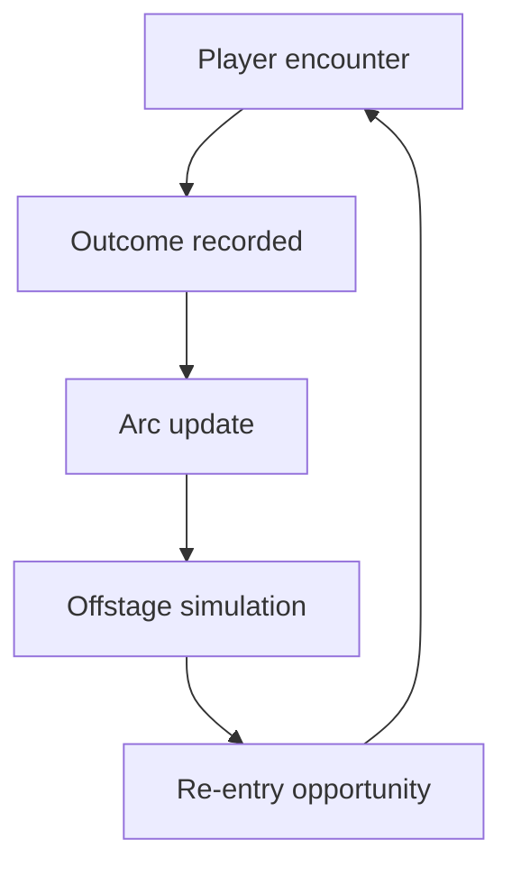

# Dramatis Personae System (Setting-Agnostic Brainstorm)

This doc is a player-facing–first brainstorm for a nemesis-style cast system that makes recurring NPCs feel personal, persistent, and consequential. It assumes NPCs are AI-generated and evolve their dispositions and lives over time, while remaining setting-agnostic.

## Player Experience

- **Recognition and continuity:** NPCs remember the player, bring up past encounters, and change their tone, offers, or behavior accordingly.
- **Meaningful consequences:** A single choice can trigger a long-running rivalry, a loyal ally arc, or a complicated love-hate relationship.
- **Emergent story arcs:** Personal vendettas, rescues, betrayals, reconciliations, and quiet character growth unfold without scripted lore.
- **A living cast:** The world feels populated by specific people with lives that progress offstage, not a disposable parade of strangers.
- **Legible stakes:** The player can see how relationships are trending and which NPCs are rising, falling, or fading.

### Parallel experience threads (pursue them all)

- **Rivals and rematches:** A recurring antagonist escalates through tiers of conflict and competence, surfacing at key moments.
- **Allies and patrons:** NPCs who invest in the player (or depend on them) unlock new options, favors, or protections.
- **Ensemble web:** Multiple NPCs compete for attention, with tensions and friendships between them that the player can influence.
- **Life events and offstage growth:** NPCs change roles, goals, and resources over time, returning with new stakes.
- **Legacy and succession:** NPCs can retire, disappear, or be replaced by successors who inherit the relationship history.
- **Reputation echoes:** Word of the player spreads through the cast, shaping first impressions before new encounters.

## Core Loop

1. **Encounter:** Player meets an NPC (new or returning) with context-aware disposition and goals.
2. **Outcome recorded:** The interaction is summarized into a structured event and relationship updates.
3. **Arc update:** The NPC’s arc stage, rivalry or alliance intensity, and narrative flags advance or cool down.
4. **Offstage simulation:** NPCs pursue goals, change location, shift relationships, or gain resources.
5. **Re-entry:** The system selects a subset of NPCs to surface again, aligned to the player’s current situation.

## System Rules

- **Spotlight budget:** Only a curated subset of NPCs can be in the active cast at once.
- **Escalation ladders:** Rivalries and alliances advance through defined tiers with clear thresholds.
- **Consequences are visible:** Each arc change yields a short, player-visible signal in text or UI.
- **Bias toward continuity:** When possible, reuse existing NPCs instead of generating new ones.
- **Offstage time matters:** NPCs can change even if the player does nothing directly to them.
- **No setting assumptions:** Roles and motivations are expressed generically (e.g., authority figure, trader, guide).
- **Recency + relevance:** Return appearances are based on relevance to current goals, not random re-rolls.

## Data Model

- `DramatisPersonaeIndex`
  - `cast`: list of spotlight NPCs with `spotlightScore`, `lastSeenAt`, `arcStage`, `arcTags`
  - `caps`: limits for active cast size and reappearance rate
  - `weights`: tuning knobs for rivalry vs ally vs ensemble emphasis
- `PersonaCard`
  - `npcId`, `knownAs`, `traits`, `goals`, `resources`, `lifeState`, `roles`
  - `dispositionToPlayer`: { `valence`, `intensity`, `trust`, `fear` }
  - `memories`: short summary + recent highlight list
- `RelationshipEdge`
  - `fromId`, `toId`, `valence`, `intensity`, `history`, `lastChangedAt`
- `ArcState`
  - `type` (rival, ally, ensemble, legacy)
  - `tier`, `triggers`, `openThreads`, `cooldown`, `escalationFlags`
- `EventLedger`
  - `eventId`, `participants`, `summary`, `effects`, `timestamp`
- `OffstageUpdate`
  - `npcId`, `changes`, `newLocationId`, `notes`

## Integration Points

- **NPC generation prompts:** Seed `PersonaCard` and arc intent when NPCs are created.
- **Player model:** Store player-specific relationships and reputational echoes.
- **Scene summaries:** Use summaries to update `memories` and `EventLedger` entries.
- **Events system:** Emit structured outcomes that advance arcs or change relationships.
- **Quests:** Tie quest outcomes to arc stages or trigger re-entries.
- **Locations and regions:** Provide relevance signals for re-entry selection.
- **Factions or groups (if used):** Translate group standing into initial NPC impressions.
- **Serialization:** Persist cast state, arc tiers, and ledgers across saves.

## Risks

- **Pacing drift:** Too-frequent reappearances can feel repetitive; too-rare returns make the system invisible.
- **NPC overload:** A bloated cast becomes forgettable without a strict spotlight budget and clear UI cues.

## Implementation Sketch

1. **Define schema:** Add `DramatisPersonaeIndex`, `PersonaCard`, `ArcState`, and `EventLedger` schemas.
2. **Cast curation:** Implement scoring for spotlight eligibility (recency, relevance, arc intensity).
3. **Prompt wiring:** Inject top cast members and their arc summaries into key prompts.
4. **Event parsing:** Record interaction outcomes and advance arc tiers.
5. **Offstage simulation:** Periodically update NPC roles, resources, and locations.
6. **Re-entry selection:** Choose NPCs based on player context and arc triggers.
7. **UI surfaces:** Add a cast list, relationship trend cues, and recent-arc highlights.
8. **Persistence:** Save/restore cast state and event history.
