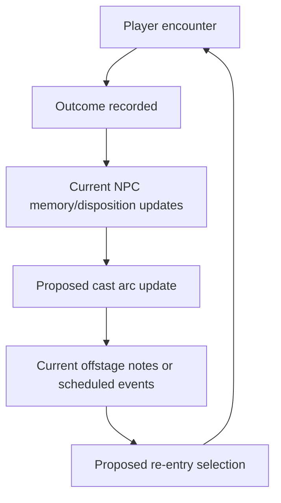

# Dramatis Personae System (Setting-Agnostic Proposal)

This is a proposal for a named recurring-cast layer. It is not currently
implemented as `DramatisPersonaeIndex`, `PersonaCard`, or a dedicated cast UI.

The current project already has several adjacent primitives:

- `Player` records for NPCs persist dispositions toward other actors, goals,
  `characterArc`, `importantMemories`, faction membership, death/hidden state,
  current location, and last-seen data.
- NPC generation prompts seed goals, character arcs, and memories; base-context
  rendering exposes relevant NPC goals, memories, dispositions, party state, and
  faction context.
- Post-turn `npc_memories` prompts can add memories, update goals, and emit
  disposition changes. Event checks and quest rewards can also change NPC
  dispositions and faction reputation.
- NPC turns, while-you-were-away prompts, scheduled events, offscreen NPC
  activity, scene summaries, mystery boxes, and mystery threads provide
  continuity tools, but they do not curate a spotlight cast or enforce arc tiers.

The proposed Dramatis layer should therefore build on existing NPC state instead
of duplicating it. Its job would be to decide which recurring characters matter
right now, why they should reappear, and how their relationship arc is progressing.

## Design Intent

The player-facing goal is a nemesis-style recurring cast system that makes NPCs
feel personal, persistent, and consequential while remaining setting-agnostic.

- **Recognition and continuity:** NPCs remember the player, bring up past
  encounters, and change their tone, offers, or behavior accordingly.
- **Meaningful consequences:** A single choice can begin a rivalry, loyal ally
  arc, debt, patronage, betrayal, or uneasy truce.
- **Emergent story arcs:** Vendettas, rescues, reconciliations, quiet personal
  growth, and succession should emerge from play rather than scripted setting lore.
- **A living cast:** Important NPCs should continue to have goals, resources, and
  relationships offstage.
- **Legible stakes:** The player should receive clear but lightweight signals when
  a relationship or recurring-cast arc changes.

## Proposed Experience Threads

- **Rivals and rematches:** Recurring antagonists escalate through conflict tiers
  and return when the current situation makes sense.
- **Allies and patrons:** NPCs who invest in the player, or depend on them,
  unlock favors, help, information, shelter, training, or protection.
- **Ensemble web:** Multiple NPCs develop friendships, tensions, dependencies,
  and grudges that the player can influence.
- **Life events and offstage growth:** NPCs change roles, goals, resources, and
  locations over time, then return with new stakes.
- **Legacy and succession:** NPCs can retire, disappear, die, or be replaced by a
  successor who inherits part of the relationship history.
- **Reputation echoes:** Word of the player can shape first impressions before a
  new NPC has met the player directly.

## Current Loop And Proposed Additions

```mermaid
flowchart TD
  A[Player encounter] --> B[Outcome recorded]
  B --> C[Current NPC memory/disposition updates]
  C --> D[Proposed cast arc update]
  D --> E[Current offstage notes or scheduled events]
  E --> F[Proposed re-entry selection]
  F --> A
```

1. **Encounter:** Existing prompt context already gives the LLM current NPC
   personality, goals, memories, dispositions, party state, and faction context.
2. **Outcome recorded:** Existing event checks, quest outcomes, NPC memory
   prompts, and scene summaries can record consequences.
3. **Cast arc update:** Proposed. A dedicated cast layer would score whether an
   NPC belongs in the active spotlight cast and advance an explicit arc state.
4. **Offstage activity:** Partly current. Offscreen NPC activity can append hidden
   story notes and move non-present NPCs; scheduled events can resolve future
   activity. A Dramatis layer would make those updates structured and arc-aware.
5. **Re-entry selection:** Proposed. The system would choose returning NPCs based
   on recency, relevance, arc pressure, location/faction fit, and pacing budget.

## Proposed System Rules

- **Reuse before generation:** Prefer a relevant existing NPC over creating a new
  one when the story role can be filled by someone already known.
- **Spotlight budget:** Keep only a curated subset of NPCs active enough to drive
  recurring-cast behavior.
- **Visible consequences:** Important arc changes should generate short
  player-facing cues, using existing summary/diff patterns where possible.
- **Setting neutrality:** Roles and motives should stay generic, such as
  authority figure, merchant, guide, dependent, rival, patron, witness, or heir.
- **Pacing discipline:** Return appearances should be selected by relevance and
  cooldowns, not random churn.
- **No hidden placeholders:** Missing required cast state should fail loudly during
  development rather than silently inventing incomplete arc data.

## Proposed Data Model

These are design names, not current classes.

- `DramatisPersonaeIndex`
  - `cast`: spotlight NPC ids with `spotlightScore`, `lastSeenAt`, `arcStage`,
    `arcTags`, `cooldownUntil`, and `nextReentryHint`
  - `caps`: active-cast size, reappearance frequency, and per-turn injection limits
  - `weights`: rivalry, ally, ensemble, faction, quest, and location relevance
- `PersonaCard`
  - References a real `Player` NPC instead of duplicating canonical NPC fields.
  - Stores cast-specific metadata: `knownAs`, `roles`, `resources`,
    `lifeState`, `arcSummary`, `openQuestions`, and `reentryHooks`
  - Reads canonical goals, memories, dispositions, faction id, location, hidden
    state, and death state from the underlying NPC record.
- `RelationshipEdge`
  - `fromId`, `toId`, `valence`, `intensity`, `type`, `history`,
    `lastChangedAt`
  - Needed because current dispositions primarily model NPC-to-player feelings,
    while faction relations model organization-to-organization ties.
- `ArcState`
  - `type`: `rival`, `ally`, `patron`, `dependent`, `ensemble`, `legacy`
  - `tier`, `triggers`, `openThreads`, `cooldown`, `escalationFlags`,
    `lastPlayerFacingSignal`
- `EventLedger`
  - Structured cast-relevant events with `eventId`, `participants`, `summary`,
    `effects`, `timestamp`, and source entry id.
  - Scene summaries and hidden offscreen entries are current narrative evidence,
    but they are not a structured cast ledger.
- `OffstageUpdate`
  - `npcId`, `changes`, `newLocationId`, `arcImpact`, `notes`, and source prompt
    or scheduled-event id.

## Integration Points

- **NPC generation:** Continue seeding goals, character arcs, and memories; add
  optional cast-role hints only when a new NPC is promoted into the spotlight cast.
- **Player/NPC model:** Keep canonical NPC state on `Player`; store only
  cast-specific indexing and arc metadata in the proposed Dramatis layer.
- **Events and quests:** Use disposition changes, faction reputation changes,
  quest completions, NPC arrivals/departures, deaths, and party changes as arc
  triggers.
- **NPC memory prompts:** Treat generated memories and goal updates as evidence for
  cast scoring and arc changes.
- **Scene summaries and Story Tools:** Use scene summaries, mystery boxes, and
  mystery threads as continuity sources, not as the authoritative cast schema.
- **Offscreen activity and scheduled events:** Let these systems create elapsed
  time pressure; the Dramatis layer would decide whether those changes should
  affect spotlight arcs or re-entry priority.
- **Locations, regions, and factions:** Use current location, last-seen data,
  faction standing, controlling factions, and region relevance to select returns.
- **UI:** A future cast surface could show spotlight NPCs, relationship trends,
  last-seen context, and recent arc highlights. Current NPC detail/edit surfaces
  already expose memories, goals, dispositions, and character data.
- **Serialization:** Persist the cast index, arc states, relationship edges, and
  event ledger in saves. Do not rely on prompt-only reconstruction.

## Risks

- **Pacing drift:** Too-frequent returns feel repetitive; too-rare returns make
  the system invisible.
- **NPC overload:** A bloated cast becomes forgettable without strict spotlight
  limits and clear UI cues.
- **Prompt bloat:** Injecting too many cast details can crowd out immediate scene
  context.
- **State duplication:** Persona data should reference canonical NPC fields where
  possible to avoid divergent memories, goals, locations, or death state.
- **Over-scripted arcs:** Arc tiers should guide continuity without forcing every
  relationship into a predictable ladder.

## Implementation Path

1. Add a persisted cast index that references existing NPC ids and validates that
   every referenced NPC exists on load.
2. Add cast scoring from current data: recency, last-seen location, dispositions,
   quest involvement, faction relevance, party history, scene-summary mentions,
   and offscreen/scheduled-event mentions.
3. Add explicit arc states for a small set of relationship types and update them
   from event outcomes, NPC memory results, quest rewards, deaths, and party
   changes.
4. Inject only the top cast entries into base-context prompts, with concise arc
   summaries and re-entry hooks.
5. Make offscreen NPC activity and scheduled-event resolution optionally write
   structured cast updates when they affect spotlight NPCs.
6. Add re-entry selection that proposes existing NPC appearances before new NPC
   generation, respecting cooldowns and location/faction plausibility.
7. Add a compact UI surface for active cast members, trend cues, recent arc
   highlights, and last-known location.
8. Add save/load and regression coverage for cast persistence, orphaned NPC
   references, arc updates, and prompt injection limits.
