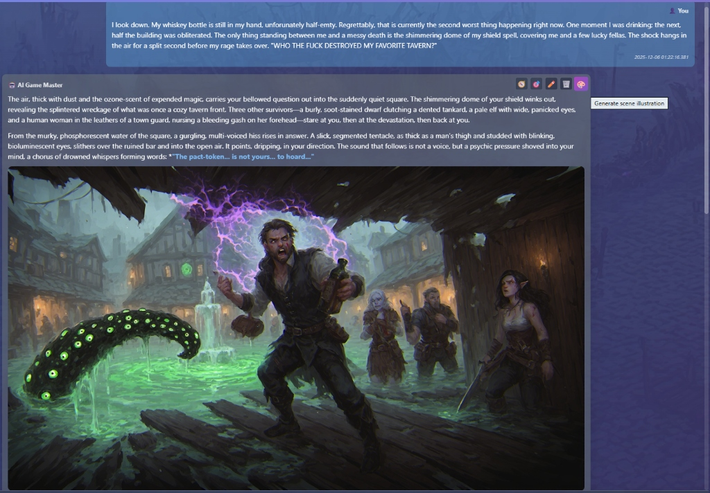

# Scene Illustration Mod

Generate AI-powered illustrations for your game scenes with a single click.



## Features

- **🎨 One-Click Generation** — Click the paint palette button on any AI message to generate an illustration
- **📸 Scene Gallery** — Browse all generated images in the dedicated "Scenes Gallery" tab
- **🔍 Lightbox View** — Click any image to view it in full-screen
- **⚙️ Configurable AI Model** — Use a different text AI model for prompt generation
- **💾 Persistent Storage** — Images are saved and persist across server restarts

## Installation

### Option 1: Clone into mods directory

```bash
cd /path/to/ai_rpg/mods
git clone https://github.com/your-repo/scene-illustration.git
```

### Option 2: Manual installation

1. Download or copy the `scene-illustration` folder
2. Place it in your game's `mods/` directory
3. Restart the server

```
mods/
└── scene-illustration/
    ├── mod.js
    ├── prompts/
    │   └── scene-illustration.xml.njk
    ├── public/
    │   ├── css/
    │   │   └── scene-illustration.css
    │   └── js/
    │       └── scene-illustration.js
    └── data/           (auto-created)
```

## Configuration

Navigate to **Configuration** and find the "Scene Illustration" section:

| Setting           | Description                                                         |
| ----------------- | ------------------------------------------------------------------- |
| **Text AI Model** | Model to use for generating image prompts (leave empty for default) |

## Usage

1. Send a message in chat and wait for the AI response
2. Hover over an AI message to reveal action buttons
3. Click the **🎨** button to generate an illustration
4. The button shows a number emoji (1️⃣-9️⃣) while processing
5. Once complete, the image appears in the message and in the Scenes Gallery

## Requirements

- AI RPG game server with mod support
- Image generation enabled (`imagegen.enabled: true`)
- Working LLM endpoint for prompt generation

## Troubleshooting

**"Cannot POST /api/mods/scene-illustration/generate"**

- Ensure the mod folder exists on the server
- Restart the server after adding the mod

**"Image generation is not enabled"**

- Enable in `config.yaml`:
  ```yaml
  imagegen:
    enabled: true
  ```

## License

MIT
